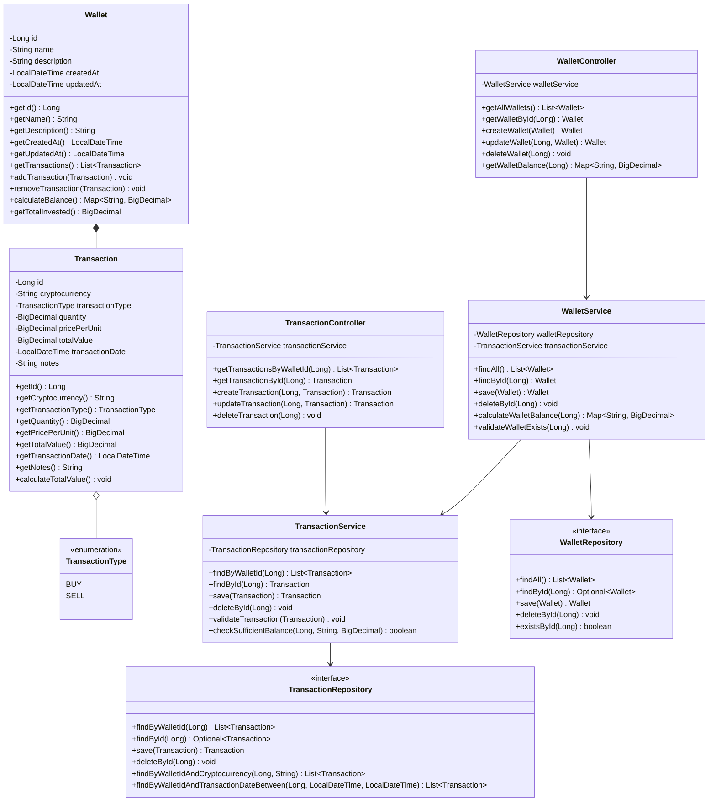

# Crypto Wallet Manager
Projeto de API Java RESTful para gerenciar carteiras de crypto, feito para praticar noçÕes publicação de API em nuvem.

## Diagrama de classes

```mermaid
classDiagram
    class Wallet {
        -Long id
        -String name
        -String description
        -LocalDateTime createdAt
        -LocalDateTime updatedAt
        +getId() Long
        +getName() String
        +getDescription() String
        +getCreatedAt() LocalDateTime
        +getUpdatedAt() LocalDateTime
        +getTransactions() List~Transaction~
        +addTransaction(Transaction) void
        +removeTransaction(Transaction) void
        +calculateBalance() Map~String, BigDecimal~
        +getTotalInvested() BigDecimal
    }
    
    class Transaction {
        -Long id
        -String cryptocurrency
        -TransactionType transactionType
        -BigDecimal quantity
        -BigDecimal pricePerUnit
        -BigDecimal totalValue
        -LocalDateTime transactionDate
        -String notes
        +getId() Long
        +getCryptocurrency() String
        +getTransactionType() TransactionType
        +getQuantity() BigDecimal
        +getPricePerUnit() BigDecimal
        +getTotalValue() BigDecimal
        +getTransactionDate() LocalDateTime
        +getNotes() String
        +calculateTotalValue() void
    }
    
    class TransactionType {
        <<enumeration>>
        BUY
        SELL
    }
    
    class WalletController {
        -WalletService walletService
        +getAllWallets() List~Wallet~
        +getWalletById(Long) Wallet
        +createWallet(Wallet) Wallet
        +updateWallet(Long, Wallet) Wallet
        +deleteWallet(Long) void
        +getWalletBalance(Long) Map~String, BigDecimal~
    }
    
    class TransactionController {
        -TransactionService transactionService
        +getTransactionsByWalletId(Long) List~Transaction~
        +getTransactionById(Long) Transaction
        +createTransaction(Long, Transaction) Transaction
        +updateTransaction(Long, Transaction) Transaction
        +deleteTransaction(Long) void
    }
    
    class WalletService {
        -WalletRepository walletRepository
        -TransactionService transactionService
        +findAll() List~Wallet~
        +findById(Long) Wallet
        +save(Wallet) Wallet
        +deleteById(Long) void
        +calculateWalletBalance(Long) Map~String, BigDecimal~
        +validateWalletExists(Long) void
    }
    
    class TransactionService {
        -TransactionRepository transactionRepository
        +findByWalletId(Long) List~Transaction~
        +findById(Long) Transaction
        +save(Transaction) Transaction
        +deleteById(Long) void
        +validateTransaction(Transaction) void
        +checkSufficientBalance(Long, String, BigDecimal) boolean
    }
    
    class WalletRepository {
        <<interface>>
        +findAll() List~Wallet~
        +findById(Long) Optional~Wallet~
        +save(Wallet) Wallet
        +deleteById(Long) void
        +existsById(Long) boolean
    }
    
    class TransactionRepository {
        <<interface>>
        +findByWalletId(Long) List~Transaction~
        +findById(Long) Optional~Transaction~
        +save(Transaction) Transaction
        +deleteById(Long) void
        +findByWalletIdAndCryptocurrency(Long, String) List~Transaction~
        +findByWalletIdAndTransactionDateBetween(Long, LocalDateTime, LocalDateTime) List~Transaction~
    }

    %% Relationships
    Wallet *-- Transaction
    Transaction o-- TransactionType
    
    WalletController --> WalletService
    TransactionController --> TransactionService
    
    WalletService --> WalletRepository
    WalletService --> TransactionService
    TransactionService --> TransactionRepository
```
