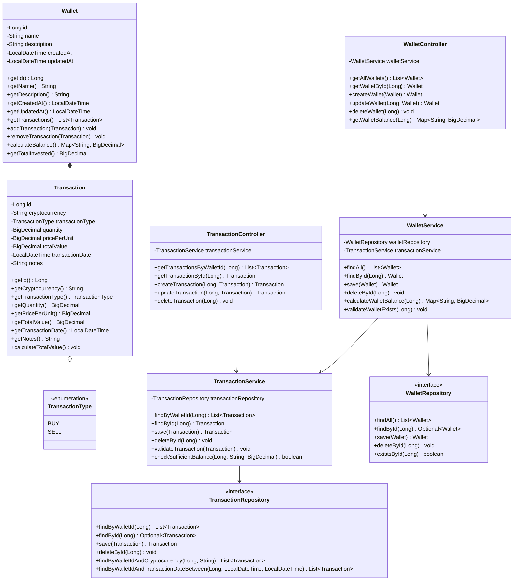

# Crypto Wallet Manager

API RESTful desenvolvida em Java Spring Boot para gerenciar carteiras de criptomoedas. Este projeto foi desenvolvido para praticar conceitos de desenvolvimento de APIs e publicação em nuvem.

## Features

- Gerenciamento de múltiplas carteiras de criptomoedas
- Registro de transações (compra e venda) de criptomoedas
- Cálculo automático de saldo por criptomoeda
- Histórico completo de transações
- Documentação completa via Swagger/OpenAPI

## Tecnologias Utilizadas

- Java 21
- Spring Boot
- Spring Data JPA
- PostgreSQL
- Swagger/OpenAPI para documentação
- Railway para deploy

## Documentação da API

A documentação completa da API está disponível através do Swagger UI nos seguintes endereços:

- **Desenvolvimento**: http://localhost:8080/swagger-ui.html
- **Produção**: https://crypto-wallet-manager-production.up.railway.app/swagger-ui.html

## Diagrama de Classes



## Endpoints Principais

### Carteiras (Wallets)
- `GET /api/wallets` - Lista todas as carteiras
- `GET /api/wallets/{id}` - Obtém uma carteira específica
- `POST /api/wallets` - Cria uma nova carteira
- `PUT /api/wallets/{id}` - Atualiza uma carteira existente
- `DELETE /api/wallets/{id}` - Remove uma carteira
- `GET /api/wallets/{id}/balance` - Obtém o saldo da carteira

### Transações (Transactions)
- `GET /api/wallets/{walletId}/transactions` - Lista transações de uma carteira
- `GET /api/transactions/{id}` - Obtém uma transação específica
- `POST /api/wallets/{walletId}/transactions` - Registra uma nova transação
- `PUT /api/transactions/{id}` - Atualiza uma transação existente
- `DELETE /api/transactions/{id}` - Remove uma transação

##  Como Executar Localmente

1. Clone o repositório:
```bash
git clone https://github.com/joao-ac/cwm.git
cd cwm
```

2. Configure as variáveis de ambiente no arquivo `application-dev.yml`

3. Execute o projeto:
```bash
./mvnw spring-boot:run -Dspring.profiles.active=dev
```

4. Acesse a documentação em: http://localhost:8080/swagger-ui.html

## Deploy

O projeto está deployado na Railway e pode ser acessado através da URL:
https://crypto-wallet-manager-production.up.railway.app
